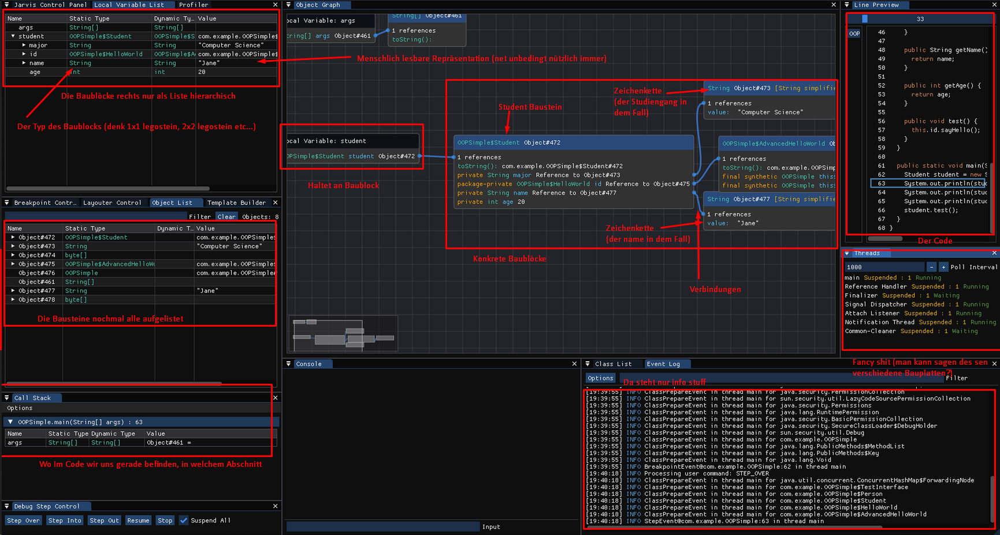

# JARVIS (Java Application Runtime Visualization and Inspection System)

JARVIS is a tool to visualize the runtime of Java programs. Similar to what a debugger does, JARVIS can inspect the state of the program at runtime. Though in contrast to standard debuggers, it offers a unique view on the full object graph at runtime.

## Features

- Visualize the **Object Graph** at runtime with control on the layout parameters
- Standard **Local Variable** tree list familiar from debuggers
- **Object List** to inspect all objects alive in the JVM
- **Class Explorer** to inspect all the loaded classes, their fields and methods and where they come from
- **Template Engine** to define custom views on the object graph
- **Event Log** to get a low level view on what is happening in the JVM
- **Call Stack** to see the current call stack
- **Line Preview** shows the source code and the current line of execution

## Requirements

- Java 17 or higher
- Libraries:
  - Imgui-Java library from [here](https://github.com/SpaiR/imgui-java) 1.86.11 or higher
  - LWJGL 3.3.3 or higher
  - SnakeYAML 2.2 or higher

All libraries are included in the `lib` folder.

Imgui-Java has been modified to allow for setting an Icon for the window.

## Origin

JARVIS was developed by [DrChristophFH](https://github.com/DrChristophFH) as part of his Bachelor Thesis at the University of Applied Sciences Upper Austria, Hagenberg Campus.

